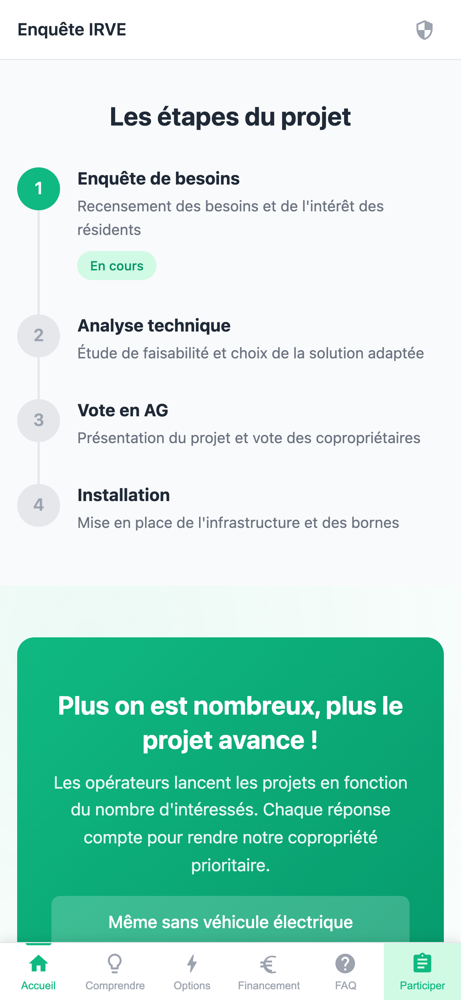
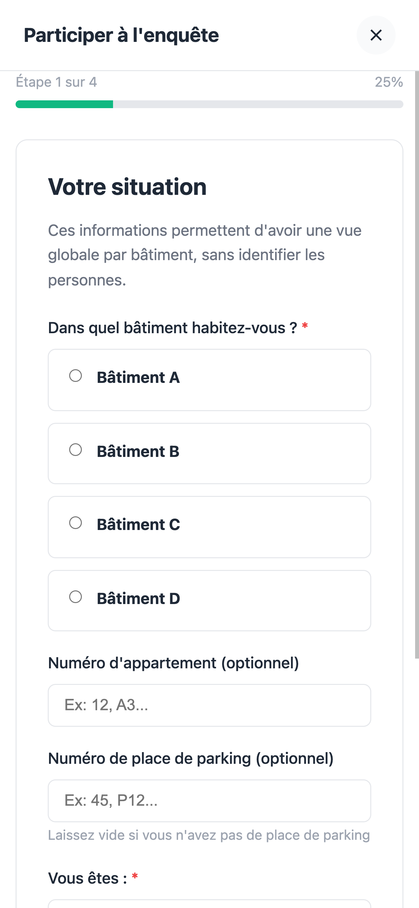
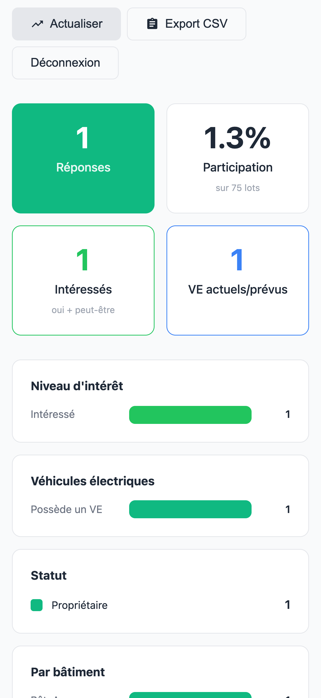
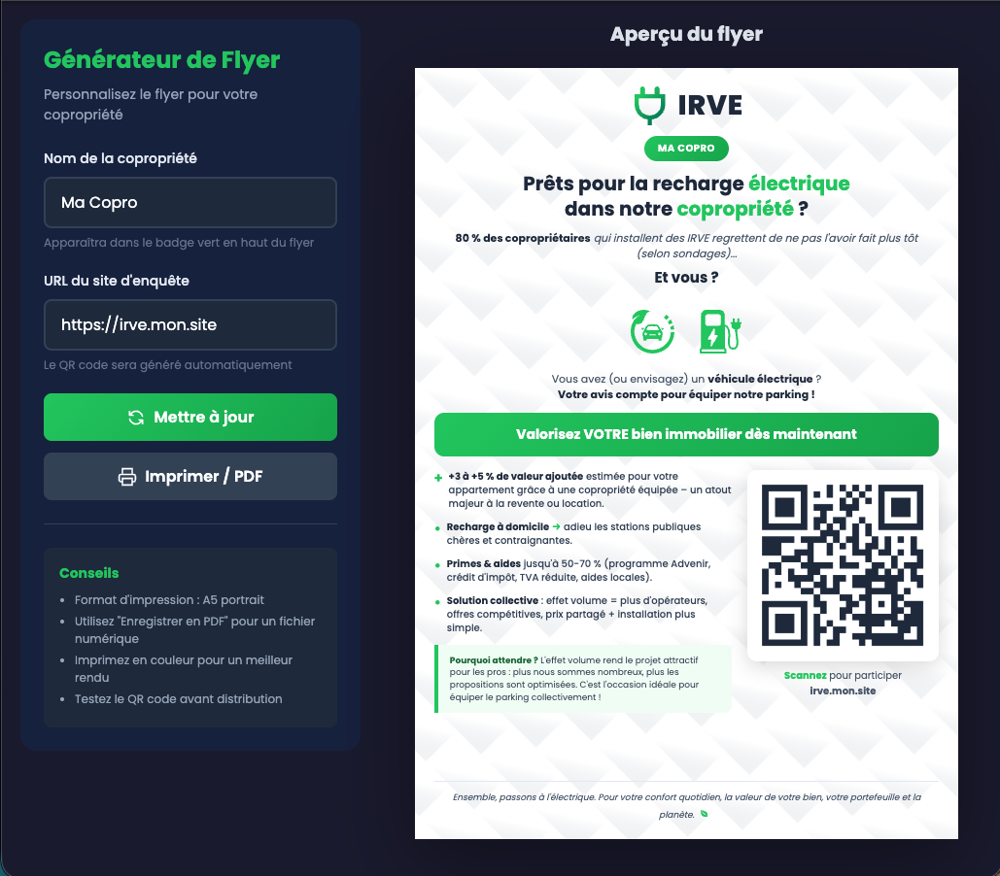

# Enquête IRVE Copropriété

[](https://opensource.org/licenses/MIT)
[](https://nodejs.org/)
[](https://vuejs.org/)
[](https://www.docker.com/)
[](#rgpd)
[](https://github.com/schlivo/irve-copro-consult/pulls)

Application web permettant aux copropriétés de sonder leurs résidents sur l'installation de bornes de recharge pour véhicules électriques (IRVE - Infrastructure de Recharge pour Véhicules Électriques).

> **Auto-hébergée, open source, conforme RGPD** - Aucune dépendance cloud, vos données restent chez vous.

## Objectif

Ce projet permet au conseil syndical d'une copropriété de :

- **Informer** les résidents sur les différentes solutions IRVE disponibles
- **Collecter** les besoins et préférences de chaque foyer
- **Mesurer** le niveau d'intérêt pour dimensionner le projet
- **Respecter** le RGPD avec une solution auto-hébergée en France

L'application est conçue pour être simple à déployer et ne nécessite aucun service tiers (pas de Google Analytics, pas de cookies tiers, pas de dépendance cloud).

## Aperçu

<p align="center">
  
</p>

<table>
  <tr>
    <td align="center" width="33%">
      <br/>
      <strong>Formulaire d'enquête</strong><br/>
      <sub>Multi-étapes, responsive</sub>
    </td>
    <td align="center" width="33%">
      <br/>
      <strong>Dashboard admin</strong><br/>
      <sub>Statistiques temps réel</sub>
    </td>
    <td align="center" width="33%">
      <br/>
      <strong>Générateur de flyer</strong><br/>
      <sub>QR code, export PDF</sub>
    </td>
  </tr>
</table>

> 💡 **Démo en ligne** : [irve.example.com](https://irve.example.com) | [Dashboard admin](https://irve.example.com/admin) | [Générateur de flyer](https://irve.example.com/flyer.html)

## Fonctionnalités

### Pour les résidents
- **Pages informatives** : Comprendre les IRVE, options techniques, aides financières, FAQ
- **Formulaire d'enquête** : Multi-étapes, responsive, accessible
- **Transparence RGPD** : Politique de confidentialité accessible

### Pour le conseil syndical
- **Tableau de bord** : Statistiques en temps réel (taux de participation, intérêt, etc.)
- **Export CSV** : Téléchargement des réponses pour analyse
- **Administration sécurisée** : Authentification par token, protection anti-brute force

### Sécurité & RGPD
- **Protection DDoS** : Rate limiting (100 req/min global, 5 soumissions/heure)
- **Anti-doublon** : Détection côté serveur + marqueur localStorage
- **Authentification** : Mot de passe hashé (bcrypt), tokens avec expiration
- **Audit trail** : Journalisation des accès et modifications
- **Conformité RGPD** : Endpoints pour export/suppression des données personnelles

## Stack technique

| Composant | Technologie |
|-----------|-------------|
| Frontend | Vue 3 (Composition API) + Vite 7 |
| Backend | Node.js 20+ / Express 4 |
| Base de données | SQLite (better-sqlite3) |
| Sécurité | Helmet, bcrypt, express-rate-limit |
| Déploiement | Docker / Node.js natif |

## Structure du projet

```
enquete-irve/
├── frontend/               # Application Vue 3
│   ├── src/
│   │   ├── components/     # Composants réutilisables
│   │   ├── views/          # Pages de l'application
│   │   └── App.vue         # Composant racine
│   ├── dist/               # Build production (généré)
│   └── package.json
├── backend/                # API Express
│   ├── src/
│   │   ├── routes/         # Endpoints API
│   │   ├── middleware/     # Auth, rate limiting
│   │   ├── db.js           # SQLite + audit
│   │   └── index.js        # Point d'entrée
│   ├── data/               # Base de données SQLite
│   └── package.json
├── Dockerfile              # Build multi-stage
├── docker-compose.yml      # Déploiement avec Traefik
└── README.md
```

---

## Installation

### Prérequis

- **Node.js 20+** (LTS recommandé)
- **npm** ou **yarn**
- **Git**

### Installation des dépendances

```bash
# Cloner le projet
git clone https://github.com/schlivo/irve-copro-consult.git
cd enquete-irve

# Backend
cd backend
npm install

# Frontend
cd ../frontend
npm install
```

### Développement local

**Terminal 1 - Backend :**
```bash
cd backend
npm run dev
# → API disponible sur http://localhost:3000
```

**Terminal 2 - Frontend :**
```bash
cd frontend
npm run dev
# → Application sur http://localhost:5173
```

---

## Configuration

### Variables d'environnement

Créer un fichier `.env` dans le dossier `backend/` :

```bash
# Serveur
PORT=3000
HOST=0.0.0.0
NODE_ENV=production

# Base de données
DB_PATH=./data/survey.db

# Sécurité
ADMIN_PASSWORD=VotreMotDePasseSecurise123!

# Configuration copropriété
BUILDINGS=A,B,C,D
TOTAL_LOTS=75
CONTACT_EMAIL=conseil-syndical@votre-copro.fr
SYNDIC_EMAIL=syndic@exemple.fr

# CORS (développement uniquement)
CORS_ORIGIN=http://localhost:5173
```

### Configuration requise

| Variable | Requis | Description |
|----------|--------|-------------|
| `ADMIN_PASSWORD` | **Oui** | Mot de passe admin (min. 12 caractères recommandé) |
| `BUILDINGS` | Non | Liste des bâtiments séparés par virgule |
| `TOTAL_LOTS` | Non | Nombre total de lots (pour calcul participation) |
| `CONTACT_EMAIL` | Non | Email du conseil syndical |

---

## Déploiement

### Option 1 : VPS / Serveur Linux (recommandé)

Cette méthode fonctionne sur tout VPS Linux (Ubuntu, Debian, etc.).

#### 1. Préparer le serveur

```bash
# Mettre à jour le système
sudo apt update && sudo apt upgrade -y

# Installer Node.js 20
curl -fsSL https://deb.nodesource.com/setup_20.x | sudo -E bash -
sudo apt install -y nodejs

# Installer PM2 (gestionnaire de processus)
sudo npm install -g pm2

# Installer Nginx (reverse proxy)
sudo apt install -y nginx
```

#### 2. Déployer l'application

```bash
# Cloner le projet
cd /var/www
sudo git clone https://github.com/schlivo/irve-copro-consult.git
sudo chown -R $USER:$USER enquete-irve
cd enquete-irve

# Installer les dépendances
cd backend && npm install --production
cd ../frontend && npm install && npm run build

# Copier le build frontend dans le backend
cp -r dist ../backend/public
```

#### 3. Configurer l'environnement

```bash
cd /var/www/enquete-irve/backend

# Créer le fichier de configuration
cat > .env << 'EOF'
PORT=3000
NODE_ENV=production
ADMIN_PASSWORD=VotreMotDePasseSecurise123!
BUILDINGS=A,B,C,D
TOTAL_LOTS=75
CONTACT_EMAIL=conseil-syndical@votre-copro.fr
EOF

# Créer le dossier data
mkdir -p data
```

#### 4. Lancer avec PM2

```bash
cd /var/www/enquete-irve/backend

# Démarrer l'application
pm2 start src/index.js --name enquete-irve

# Configurer le démarrage automatique
pm2 startup
pm2 save
```

#### 5. Configurer Nginx

```bash
sudo nano /etc/nginx/sites-available/enquete-irve
```

```nginx
server {
    listen 80;
    server_name irve.votre-domaine.fr;

    location / {
        proxy_pass http://127.0.0.1:3000;
        proxy_http_version 1.1;
        proxy_set_header Upgrade $http_upgrade;
        proxy_set_header Connection 'upgrade';
        proxy_set_header Host $host;
        proxy_set_header X-Real-IP $remote_addr;
        proxy_set_header X-Forwarded-For $proxy_add_x_forwarded_for;
        proxy_set_header X-Forwarded-Proto $scheme;
        proxy_cache_bypass $http_upgrade;
    }
}
```

```bash
# Activer le site
sudo ln -s /etc/nginx/sites-available/enquete-irve /etc/nginx/sites-enabled/
sudo nginx -t
sudo systemctl reload nginx
```

#### 6. Activer HTTPS avec Let's Encrypt

```bash
# Installer Certbot
sudo apt install -y certbot python3-certbot-nginx

# Obtenir le certificat
sudo certbot --nginx -d irve.votre-domaine.fr

# Renouvellement automatique (déjà configuré par Certbot)
```

---

### Option 2 : Docker

#### Docker Swarm + Traefik

Deploy as a stack behind an existing Traefik proxy. **No host ports** are published for the app; Traefik routes by hostname.

| Where            | Port  | Role                                      |
|------------------|-------|-------------------------------------------|
| Host             | 80    | Traefik HTTP (optional redirect to HTTPS) |
| Host             | 443   | Traefik HTTPS (websecure)                 |
| Container only   | 3000  | App (Traefik targets this via overlay)   |

**Check alignment on the host:**

```bash
./scripts/deploy-check.sh
```

**Deploy:**

```bash
docker build -t enquete-irve:latest .
# Set .env (ADMIN_PASSWORD, BUILDINGS, etc.)
docker stack deploy -c docker-compose.yml irve
docker service ls
docker service logs irve_enquete-irve
```

Requires: Swarm initialized, overlay network `traefik-public`, Traefik with `websecure` and `letsencrypt`, DNS pointing to your host.

#### Avec Docker Compose (standalone)

```bash
# Cloner et configurer
git clone https://github.com/schlivo/irve-copro-consult.git
cd enquete-irve

# Modifier docker-compose.yml avec votre domaine
nano docker-compose.yml

# Lancer
docker-compose up -d
```

#### Sans Docker Compose

```bash
# Build
docker build -t enquete-irve:latest .

# Lancer
docker run -d \
  --name enquete-irve \
  -p 3000:3000 \
  -v $(pwd)/data:/app/data \
  -e ADMIN_PASSWORD="VotreMotDePasse" \
  -e BUILDINGS="A,B,C,D" \
  -e TOTAL_LOTS="75" \
  enquete-irve:latest
```

---

### Option 3 : OVH

#### VPS OVH (Starter, Essential, Comfort)

Suivre les instructions **Option 1 : VPS** ci-dessus. OVH fournit des VPS avec Ubuntu/Debian pré-installé.

**Spécificités OVH :**
```bash
# Configurer le firewall OVH depuis l'interface web
# Ouvrir les ports 80 (HTTP) et 443 (HTTPS)

# Sur le serveur, configurer ufw si nécessaire
sudo ufw allow 'Nginx Full'
sudo ufw enable
```

#### Hébergement Web OVH (mutualisé)

⚠️ **Non compatible** : Les hébergements mutualisés OVH ne supportent pas Node.js. Utilisez un VPS.

---

### Option 4 : Hébergeurs français compatibles Node.js

#### o2switch (recommandé pour mutualisé Node.js)

o2switch supporte Node.js via cPanel.

1. Commander un hébergement sur [o2switch.fr](https://www.o2switch.fr)
2. Accéder à cPanel → "Setup Node.js App"
3. Créer une application Node.js :
   - Version : 20.x
   - Mode : Production
   - Application root : `enquete-irve/backend`
   - Application URL : votre-domaine.fr
   - Application startup file : `src/index.js`
4. Uploader les fichiers via File Manager ou FTP
5. Configurer les variables d'environnement dans cPanel
6. Lancer l'application

#### Infomaniak

Infomaniak propose des serveurs cloud compatibles.

1. Commander un **Serveur Cloud** (pas l'hébergement mutualisé)
2. Choisir Ubuntu 22.04
3. Suivre les instructions **Option 1 : VPS**

#### Scaleway / OVH Public Cloud

Pour les projets nécessitant plus de ressources :

```bash
# Utiliser Docker sur une instance cloud
# Suivre Option 2 : Docker
```

---

### Option 5 : Hébergement maison (Self-hosting)

Pour héberger sur un Raspberry Pi, NAS Synology, ou serveur personnel.

#### Raspberry Pi (4 ou 5)

```bash
# Installer Node.js
curl -fsSL https://deb.nodesource.com/setup_20.x | sudo -E bash -
sudo apt install -y nodejs

# Suivre ensuite les étapes de l'Option 1
# Utiliser PM2 pour la persistance
```

#### NAS Synology (Docker)

1. Installer le paquet **Docker** depuis le Centre de paquets
2. Créer un dossier partagé pour les données
3. Utiliser **Container Manager** pour déployer l'image Docker
4. Configurer le reverse proxy dans **Portail des applications**

#### Accès externe

Pour accéder depuis Internet :
- Configurer une redirection de port sur votre box (80 → IP locale:3000)
- Utiliser un service DDNS (No-IP, DuckDNS) si IP dynamique
- **Recommandé** : Utiliser Cloudflare Tunnel pour éviter d'ouvrir des ports

---

## API

### Endpoints publics

| Méthode | URL | Description |
|---------|-----|-------------|
| `GET` | `/api/health` | Health check |
| `GET` | `/api/config` | Configuration publique (bâtiments, emails) |
| `GET` | `/api/stats` | Statistiques agrégées (anonymes) |
| `POST` | `/api/survey` | Soumettre une réponse |

### Endpoints protégés (authentification requise)

| Méthode | URL | Description |
|---------|-----|-------------|
| `POST` | `/api/stats/auth` | Authentification admin |
| `POST` | `/api/stats/logout` | Déconnexion |
| `GET` | `/api/stats/export` | Export CSV |
| `GET` | `/api/stats/admin/audit` | Journal d'audit |
| `GET` | `/api/stats/admin/duplicates` | Doublons détectés |
| `DELETE` | `/api/stats/admin/cleanup` | Nettoyage données anciennes |

### Endpoints RGPD

| Méthode | URL | Description |
|---------|-----|-------------|
| `POST` | `/api/stats/rgpd/request` | Demande d'accès/suppression |
| `GET` | `/api/stats/rgpd/export/:email` | Export données personnelles |
| `DELETE` | `/api/stats/rgpd/delete/:email` | Suppression données |
| `POST` | `/api/stats/rgpd/withdraw-consent` | Retrait consentement |

---

## Maintenance

### Sauvegarde

```bash
# Sauvegarder la base de données
cp /var/www/enquete-irve/backend/data/survey.db /backup/survey-$(date +%Y%m%d).db
```

### Mise à jour

```bash
cd /var/www/enquete-irve

# Récupérer les mises à jour
git pull

# Mettre à jour les dépendances
cd backend && npm install --production
cd ../frontend && npm install && npm run build
cp -r dist ../backend/public

# Redémarrer
pm2 restart enquete-irve
```

### Logs

```bash
# Voir les logs en temps réel
pm2 logs enquete-irve

# Voir les logs d'audit (dans la base de données)
sqlite3 data/survey.db "SELECT * FROM audit_log ORDER BY timestamp DESC LIMIT 20;"
```

---

## RGPD

### Données collectées

| Donnée | Obligatoire | Finalité |
|--------|-------------|----------|
| Bâtiment | Oui | Statistiques par bâtiment |
| Statut (proprio/locataire) | Oui | Analyse des besoins |
| Intérêt IRVE | Oui | Dimensionnement projet |
| Email | Non | Contact si consentement |
| Adresse IP | Auto | Sécurité (anti-fraude) |

### Durée de conservation

- **Données enquête** : Fin du projet + 1 an
- **Logs d'audit** : 2 ans
- **Suppression automatique** : Configurée par défaut

### Droits des personnes

Les résidents peuvent exercer leurs droits via :
- Le lien "Politique de confidentialité" dans l'application
- Email au conseil syndical
- Endpoints API RGPD

---

## Dépannage

### L'application ne démarre pas

```bash
# Vérifier les logs
pm2 logs enquete-irve --lines 50

# Vérifier que le port n'est pas utilisé
lsof -i :3000

# Reconstruire les modules natifs
cd backend && npm rebuild
```

### Erreur de base de données

```bash
# Vérifier les permissions
ls -la data/
chmod 755 data/
chmod 644 data/survey.db

# Vérifier l'intégrité
sqlite3 data/survey.db "PRAGMA integrity_check;"
```

### Certificat SSL expiré

```bash
# Renouveler manuellement
sudo certbot renew

# Vérifier le renouvellement automatique
sudo certbot renew --dry-run
```

---

## Développement

Ce projet a été développé avec l'assistance de [Claude](https://claude.ai) (Anthropic), un assistant IA. Claude a contribué à :

- L'architecture et la structure du projet
- L'implémentation du backend Express et du frontend Vue 3
- Les mesures de sécurité (CSP, rate limiting, protection RGPD)
- La documentation et les bonnes pratiques

Le code a été revu et validé par un développeur humain. Cette transparence reflète notre conviction que la collaboration humain-IA peut produire des logiciels de qualité tout en restant honnête sur les outils utilisés.

---

## Licence

MIT License - Voir le fichier [LICENSE](LICENSE) pour plus de détails.

Ce projet est open source et peut être librement utilisé, modifié et distribué.

---

## Support

- **Issues** : [GitHub Issues](https://github.com/schlivo/irve-copro-consult/issues)
- **Discussions** : [GitHub Discussions](https://github.com/schlivo/irve-copro-consult/discussions)

---

## Contribuer

Les contributions sont les bienvenues ! N'hésitez pas à :

1. Fork le projet
2. Créer une branche (`git checkout -b feature/amelioration`)
3. Commit vos changements (`git commit -m 'Ajout d'une fonctionnalité'`)
4. Push sur la branche (`git push origin feature/amelioration`)
5. Ouvrir une Pull Request

---

## Soutenir le projet

Si cet outil vous aide à lancer votre projet IRVE en copropriété, un petit geste me motive à continuer !

[](https://github.com/sponsors/schlivo)

Vous pouvez aussi contribuer en :
- Partageant le projet avec d'autres copropriétés
- Signalant des bugs ou proposant des améliorations
- Ajoutant une étoile au repo
